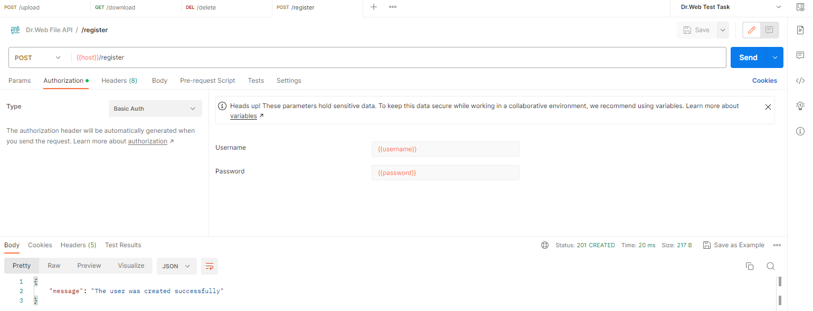
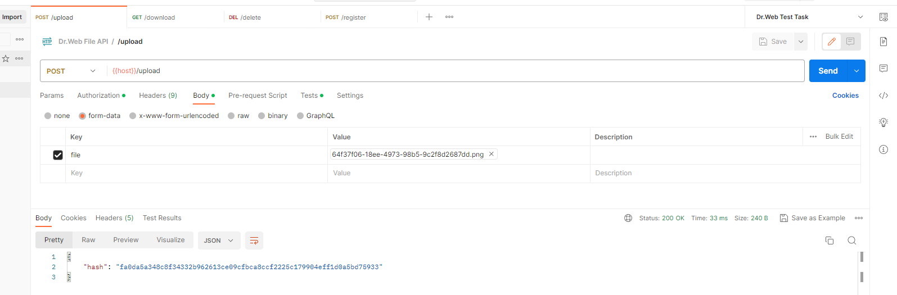
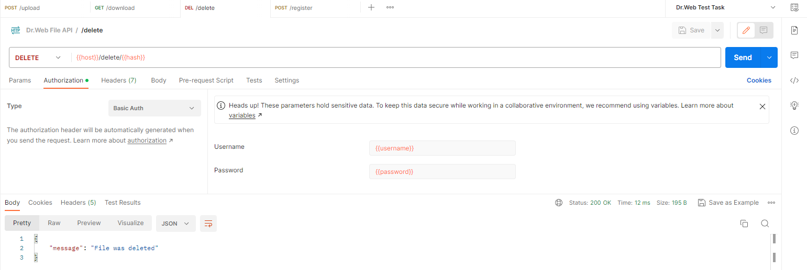

# FileIneractionAPI
Данный репозиторий представляет собой API, написанное на Flask. Ниже представлен информационный список о проекте: 
+ Было решено не использовать расширения по типу Flask-RESTful, Flask-HTTPAuth и другие,
так как сложность проекта позволяет обойтись без них,
+ Для хранения информации о владельцах файлов и пользователях, прошедших регистрацию через Basic Auth, 
на данный момент используются словари, однако база данных sqlite3 здесь больше подходит, поэтому вскоре код будет обновлен,
+ Данные пользователя (имя и пароль) хранятся в виде их хеша sha256 для обеспечения конфиденциальности.

# Демонстрация функциональности API
Для тестирования функционала проекта использовался Postman. Скриншоты позитивного тестирования будут показаны ниже. 
Негативное тестирование было также проведено, об этом будет написано под следующим заголовком.

> В Postman была использована среда переменных, а также скрипт для задания переменной hash 
> значения хеша только что загруженного файла. Поэтому на скриншотах не будет напрямую показаны 
> некоторые данные.

# Ошибки на данный момент
В данной реализации есть одна ошибка, напрямую связанная с методом хранения 
необходимых для работы API данных. При перезапуске веб-сервера все ранее добавленные данные 
стираются, что делает невозможным, например, удаление ранее добавленного файла. Данная ошибка будет исправлена, 
когда в проект будет интегрирована база данных sqlite3.
